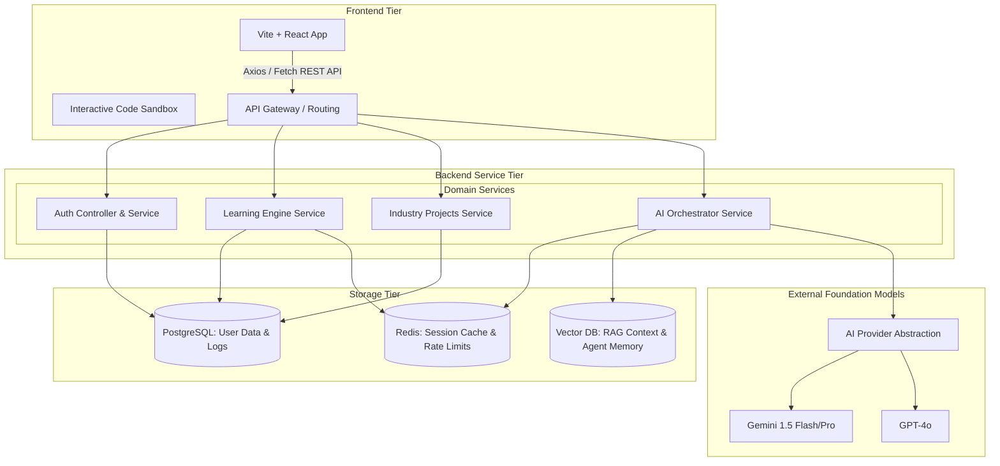
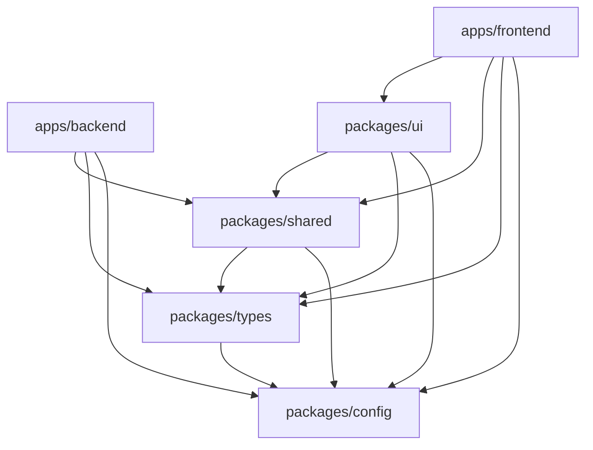

# System Architecture, Folder Structure, & Dependencies

This document provides a comprehensive view of the architectural layout, directory organization, and dependency requirements for the **AI Software Engineering Learning Platform**.

---

## 1. High-Level Architecture Diagram

The diagram below illustrates the flow of requests from the user interaction in the browser down through the application layers, data storage, and external AI orchestrations.



---

## 2. Folder Structure Documentation

### Monorepo Workspaces Layout

Below is the directory breakdown of the enterprise monorepo, outlining the roles of the apps and shared packages.

```
webbbbb/
├── apps/
│   ├── backend/                  # REST API Server Application
│   │   ├── prisma/               # Prisma Database Schemas & Migrations
│   │   └── src/
│   │       ├── config/           # Server configurations & env setups
│   │       ├── controllers/      # Route request/response entrypoints
│   │       ├── middleware/       # Express security & validation filters
│   │       ├── modules/          # Business logic groups (e.g., Learning, Projects)
│   │       ├── repositories/     # Data Access Objects wrapping Prisma clients
│   │       ├── routes/           # Endpoint registrations & controller mapping
│   │       ├── services/         # Orchestrates operations, DB query maps
│   │       ├── types/            # Local server typing specifications
│   │       ├── utils/            # Shared utilities (logging, hashing)
│   │       ├── validators/       # Input schemas validation (Zod)
│   │       └── index.ts          # Express application entrypoint
│   │
│   └── frontend/                 # Client SPA Application
│       ├── e2e/                  # Playwright browser integration tests
│       └── src/
│           ├── assets/           # Logos, SVGs, static image resources
│           ├── components/       # Layout-agnostic visual component blocks
│           ├── contexts/         # React system states (Auth, Progress tracking)
│           ├── hooks/            # Custom React hooks (usePlayground, useAI)
│           ├── layouts/          # Responsive page containers (Sidebar, Layout shell)
│           ├── pages/            # Navigable page routing layouts
│           ├── services/         # Axios wrapper connections for backend endpoints
│           ├── styles/           # Global design-token systems (Vanilla CSS)
│           ├── types/            # Component property interface specs
│           ├── utils/            # Client side formatters and parsers
│           └── main.tsx          # Client bundle mount script
│
├── packages/                     # Shareable internal library packages
│   ├── config/                   # Global configuration variables & theme options
│   ├── shared/                   # Shared validation rules, string utils, and tools
│   ├── types/                    # Common interface types shared between client & server
│   └── ui/                       # Decoupled component library (Design tokens UI)
│
├── docker/                       # Dockerfiles and docker-compose definitions
├── docs/                         # Specifications & Analysis documentation reports
└── scripts/                      # Operational management shell/batch scripts
```

---

## 3. Monorepo Dependency Diagram

To prevent circular dependencies and compile conflicts, the platform enforces a **strict one-way dependency resolution**. Shareable packages are resolved locally by `pnpm`, and they cannot import upward (e.g., packages cannot import from apps).



### Dependency Rules:

1.  **Leaf Nodes**: `packages/types` and `packages/config` depend on nothing else, acting as clean primitives.
2.  **No Downward Imports**: Packages cannot import files or utilities from `apps/frontend` or `apps/backend`.
3.  **No Circular References**: Packages cannot import horizontally in a circular manner (e.g., `packages/types` is prohibited from importing `packages/shared`).
