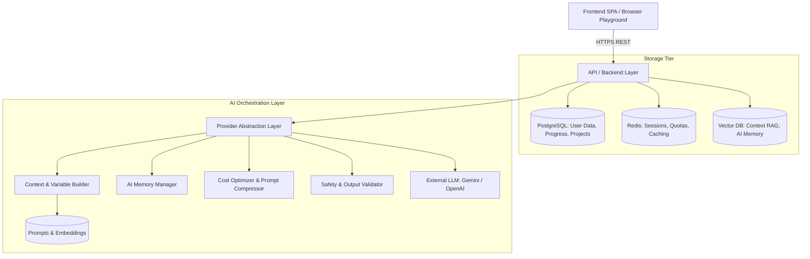
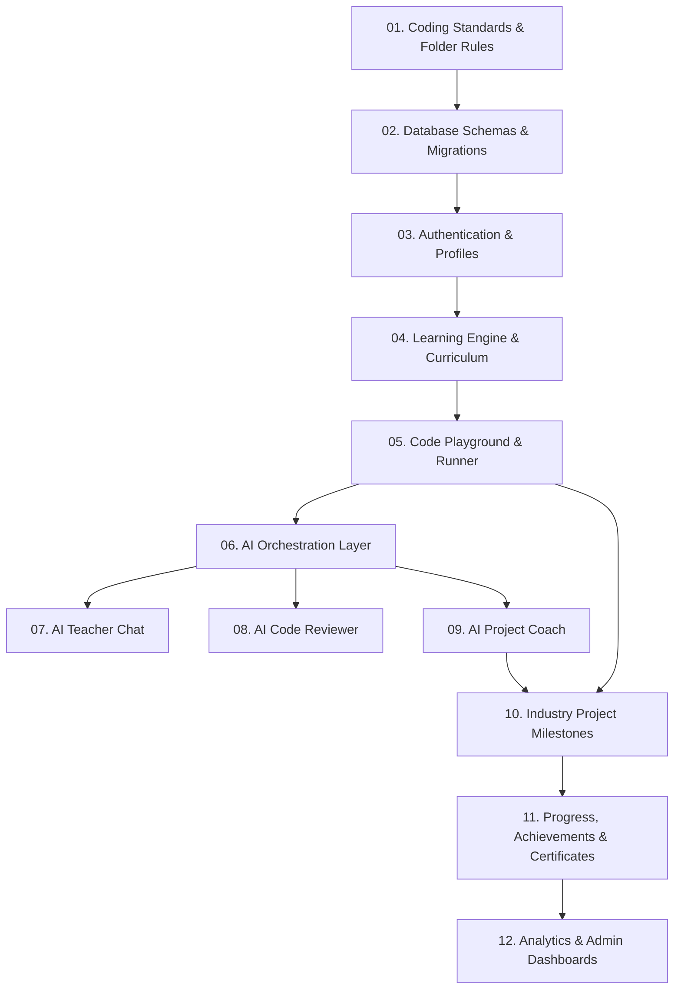

# Architecture Analysis Report: AI Software Engineering Learning Platform

## 1. Product Summary

The **AI Software Engineering Learning Platform** is an immersive, project-based educational ecosystem designed to bridge the gap between traditional developer bootcamps/tutorials and professional, production-grade software engineering roles.

Traditional platforms focus on isolated, toy exercises that teach syntax but fail to expose students to large-scale system design, git versioning, modular refactoring, and code review processes. This platform solves this problem by centering the entire learning experience around building a **single, production-grade enterprise application** (e.g., E-commerce, SaaS, LMS) across a structured curriculum. Learning is guided by three customized AI agent roles (Teacher, Reviewer, Coach) to reinforce best engineering practices.

The platform is designed around a **documentation-first development workflow**, requiring complete technical design specifications to exist as the source of truth before implementation begins.

---

## 2. Core Modules

The specifications in the workspace define 16 core modules:

1.  **Project Information**: Platform goals, terminologies, and overall system vision.
2.  **Product**: Identifies target audiences, problem statements, success metrics, and product philosophies.
3.  **User Experience (UX)**: Sets up persona Journeys, dashboards, navigation paths, and user flows.
4.  **Learning System**: Orchestrates course structure, lessons, quizzes, exercises, coding challenges, revision prompts, progress tracking, achievements, and certifications.
5.  **AI Architecture**: Abstracts LLM providers and defines context creation, semantic memory, cost control, prompt flows, output validation, and safety filters.
6.  **Industry Projects**: Maps lessons to concrete milestones in full-scale apps (Ecommerce, SaaS, LMS, Social Media).
7.  **Features**: User interfaces like playgrounds, progress dashboards, admin dashboards, prompt managers, search engines, and settings panels.
8.  **Database**: Outlines PostgreSQL relational storage, Redis cache/session/queue management, and Vector databases for semantic storage and AI memory.
9.  **Backend**: Establishes modular REST API structures, API versioning, error responses, and service integration.
10. **Prompt Architecture**: Prompt standards, dynamic variable structures, templates, and persona system prompts.
11. **Rules**: Development guidelines including coding standards, folder structures, naming conventions, and Git branching rules.
12. **Security**: Handles authentication, role-based authorization (RBAC), rate-limiting, secrets management, input validation, and prompt injection mitigation.
13. **Testing**: Comprehensive testing suite (unit, integration, E2E, load, and AI output quality evaluation).
14. **Deployment**: CI/CD workflows, Docker containerization, logging formats, monitoring protocols, scaling structures, and production release plans.
15. **Future**: Long-term expansion including plugins, classrooms/teams, and mobile client applications.

---

## 3. High-Level Architecture

The platform is designed as a modular three-tier web application, decoupled from specific AI foundation models through a provider abstraction layer.

### Architectural Diagram



### Component Breakdown

- **Frontend**: Renders the responsive dashboard, analytics charts, and a web-based code playground interface.
- **Backend Services**: Exposes REST API endpoints. Key modules (Auth, Learning, Projects, AI Orchestration, and Admin) are structured as decoupled services within the server process to ensure clean separation of concerns.
- **Database & Cache**:
  - _PostgreSQL_: Core relational transactions, progress tracking, and user data.
  - _Redis_: Session storage, API rate-limiting, and temporary caching for analytics and dashboards.
  - _Vector Database_: Embeds lessons, project documentation, and student interaction history for RAG (Retrieval-Augmented Generation) and AI agent memory.
- **AI Orchestrator**: The backend interface that retrieves template prompts, injects variables, parses history, compresses context to minimize cost, screens inputs for injections, maps to LLM providers, and validates outputs before returning them to the user.

---

## 4. Feature Dependency Graph

The dependencies between core systems are illustrated below:



---

## 5. Development Order

Based on the feature dependency graph, the recommended build order is:

1.  **Phase 0 (Setup)**: Create base folder structures, linting configurations (ESLint/Prettier or Ruff/Black), git workflows, and initial Docker configurations.
2.  **Phase 1 (Database Core)**: Run database setups, including PostgreSQL entity tables (Users, Progress, Submissions), Redis connection wrappers, and Vector DB schema configurations.
3.  **Phase 2 (Auth & User API)**: Create registration, JWT login/refresh endpoints, and RBAC authentication middlewares.
4.  **Phase 3 (Curriculum & Learning Engine)**: Build the logic that registers domains, modules, lessons, and tracks progression restrictions (unlocking criteria).
5.  **Phase 4 (Frontend UI System)**: Implement the global theme, layout shells (navigation, headers), and base component library (buttons, inputs, cards).
6.  **Phase 5 (Playground & Lesson Component)**: Integrate the rich code editor layout, code submission APIs, and standard lesson page layouts.
7.  **Phase 6 (AI Orchestration Core)**: Implement system prompts retrieval, dynamic variable injection, safety filtering, and provider abstractions for API fallbacks.
8.  **Phase 7 (AI Agents Implementation)**:
    - _AI Teacher_: Chat endpoint that answers code/concept questions in context.
    - _AI Reviewer_: Endpoint evaluating submitted code challenges.
    - _AI Project Coach_: Explains project milestones and code architectures.
9.  **Phase 8 (Industry Project System)**: Implement file-state tracking, milestone verification APIs, and integration with the AI Project Coach.
10. **Phase 9 (Gamification & Admin Tools)**: Implement dashboard metrics, achievement triggers, certificate generators, and admin panels (prompt manager, course builder).

---

## 6. Technical Risks

- **AI API Cost and Rate Limits**: Continuous code reviews and context-heavy chat logs will rapidly exhaust token budgets and hit provider limits.
  - _Mitigation_: Implement Redis caching of identical questions, use prompt compression, trim historical context, and utilize smaller models (e.g., Gemini Flash) for simple tasks, reserving large models (e.g., Gemini Pro) for advanced code reviews.
- **Plagiarism and AI Solution Exposure**: Students can prompt-inject the AI Coach to write the code for them, defeating the educational purpose.
  - _Mitigation_: Implement a secondary AI-checking layer (or structured safety rules) that screens inputs for "give me the solution" requests, and programmatically filter outbound responses containing code blocks matching the correct solutions.
- **Playground Code Execution Security**: Executing user-written code poses severe Remote Code Execution (RCE) vulnerabilities if run directly on server resources.
  - _Mitigation_: Execute student exercise code in a browser-native sandboxed container (such as Pyodide for Python, WebAssembly engines, or isolated secure worker nodes on the backend).
- **State-Syncing in Industry Projects**: Connecting the AI Coach to actual multi-file projects built by the student is complex. If the AI doesn't know the exact project file layout and content, it cannot guide them.
  - _Mitigation_: Create a lightweight, secure code state analyzer on the backend that reads the student's project files structure and modified git diffs, appending this schema map into the AI Coach context.

---

## 7. Missing Documentation

Since the current markdown files are high-level placeholders (typically containing only 1-3 sentences), the following critical specifications are missing and must be defined before development begins:

1.  **Detailed DB Schema specifications**: `07_Database/Tables.md` lacks entity tables, columns, primary/foreign key definitions, data types, constraints, and index details.
2.  **API Schema specifications**: `08_Backend/API Overview.md` and related endpoints lack request schemas, query parameters, response JSON formats, and HTTP verb definitions.
3.  **Prompt Templates & Logic**: `10_Prompt_Architecture` does not include actual system instructions, few-shot training examples, or evaluation parameters for the AI Teacher, Reviewer, and Coach.
4.  **Sandbox Execution Architecture**: There is no specification on how student code is executed, tested, and graded (unit tests format, grading API hooks).
5.  **Project Milestone Data**: There are no structured checklists, files to modify, or automated test cases for the E-commerce, SaaS, LMS, and Social Media projects.

---

## 8. Clarification Questions

These architectural questions require immediate stakeholder feedback:

1.  **Backend and Frontend Stack Selection**: What is the preferred tech stack? (e.g., NestJS/TypeScript + Next.js vs. FastAPI/Python + React).
2.  **Project Workspace Environment**: How do students build the industry projects? Will they work inside an in-browser WebIDE (like Monaco/VSCode online) or locally on their computers, pushing to a platform-hosted Git repository to trigger code evaluations?
3.  **Target AI Models**: Which foundation model providers are preferred for launch (e.g., Google Vertex AI/Gemini 1.5 vs. OpenAI API/GPT-4o)?
4.  **Code Sandbox Location**: Will exercise code be executed on the frontend (WebAssembly) or on backend servers (Docker/MicroVM containers)?
5.  **Certification Authority**: Are certificates automatically generated based solely on AI review approvals, or is there an administrative validation workflow?

---

## 9. Recommended Folder Structure

Following the guidelines in the workspace rules, here is the proposed folder structure:

```
webbbbb/
├── docs/                           # Architectural analysis and documentation
│   ├── ArchitectureAnalysis.md     # This report
│   └── specifications/             # Fleshed-out feature, API, and schema designs
├── backend/                        # Server application
│   ├── src/
│   │   ├── config/                 # DB, Redis, and LLM provider credentials
│   │   ├── controllers/            # API Route handlers (Auth, Learning, AI, Projects)
│   │   ├── middlewares/            # Auth gates, validation schemas, rate-limiting
│   │   ├── models/                 # Database tables & vector schemas (ORM / Raw SQL)
│   │   ├── services/               # Core logic (AI Orchestrator, Learning progression, Sandbox runner)
│   │   ├── routes/                 # Express/FastAPI routes mapping
│   │   └── index.ts                # Application entrypoint
│   ├── package.json
│   └── Dockerfile
├── frontend/                       # Client Single Page Application (SPA)
│   ├── src/
│   │   ├── components/             # Reusable UI component library (design tokens)
│   │   ├── context/                # Authentication & learning states
│   │   ├── hooks/                  # Custom hooks (useChat, usePlayground)
│   │   ├── pages/                  # Views (Dashboard, PlayGround, ProjectWorkspace, Admin)
│   │   ├── styles/                 # Global Vanilla CSS styling files
│   │   └── utils/                  # Helper utilities
│   ├── package.json
│   └── tsconfig.json
├── shared/                         # Common validation schemas and TypeScript interfaces
└── infrastructure/                 # Docker-compose, CI/CD actions, Nginx setups
```

---

## 10. Overall Development Strategy

- **Phase-Gated Documentation**: Fleshing out the database tables and API schemas must precede any code writing. No service files will be created until their corresponding specifications are finalized.
- **Prompt Engineering and Evaluation (LLMOps)**: Prompts will be treated as code. They will be versioned inside `10_Prompt_Architecture` and evaluated using standard test suites (testing against injection, incorrect formatting, and logic gaps) before integration into backend routes.
- **Mock-First Frontend**: Frontend layouts and the code playground UI will be developed using mocked backend responses (providing pre-designed courses, lessons, and reviews) to unblock client-side design and usability testing.
- **Security & Guardrails First**: AI rate-limiting, safety filters, and execution sandboxing will be implemented early to ensure the system is secure and cost-controlled before any public or internal preview deployment.
