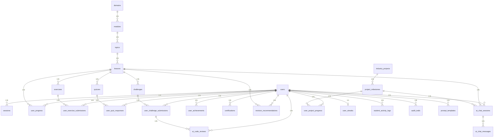

# Database Architecture & Design Specifications

This document outlines the database design, ER schema relationships, indexing patterns, migration workflows, seeding protocols, and backup plans for the **AI Software Engineering Learning Platform**.

---

## 1. Database Architecture & Schema normalization

### Technology Stack Choices

- **Primary Database: PostgreSQL (v16)**
  - _Purpose_: Structured storage for transactional logs, user profiles, lesson records, progress metrics, project milestone validations, achievements, and audit logs.
  - _Rationale_: Implements ACID-compliance, strict foreign key constraints, JSONB column indexing (for variable schemas), and robust support for relational modeling.
- **Cache Store: Redis (v7)**
  - _Purpose_: Caching application state sessions, user rate limits, and short-term dashboard analytics.
- **Semantic Store: Vector Database (e.g., pgvector extension or dedicated service)**
  - _Purpose_: High-dimensional vector storage of embeddings representing lessons, project requirements, and chat histories to enable semantic RAG (Retrieval-Augmented Generation) search.

### Schema Normalization (3NF)

The relational schema in [schema.prisma](file:///c:/Users/nyash/OneDrive/Desktop/webbbbb/apps/backend/prisma/schema.prisma) is normalized to **Third Normal Form (3NF)**:

1.  **First Normal Form (1NF)**: Every table has a primary key (UUIDs), and columns contain only atomic values. Repeating groups (like quiz choices or file checklists) are stored as JSON structures or separate tables to prevent multi-value issues.
2.  **Second Normal Form (2NF)**: All non-key attributes are fully functionally dependent on the primary key. In intersection tables (like `user_achievements` and `user_project_progress`), composite keys or foreign keys map dependencies.
3.  **Third Normal Form (3NF)**: Transitively dependent columns are eliminated. For instance, the learning curriculum is normalized into a clean hierarchical path: `Domain -> Module -> Topic -> Lesson -> Exercise/Quiz/Challenge` rather than embedding course titles or modular details within individual lesson submissions.

---

## 2. Entity Relationship (ER) Diagram

The following Mermaid diagram illustrates the tables, fields, constraints, and structural cardinalities:



---

## 3. Index Strategy

To guarantee sub-millisecond query execution times under load, index structures are declared on targeted query vectors:

### Automatic Indexes

- **Primary Keys**: B-Tree indexes created automatically on all `id` columns.
- **Unique Constraints**: Unique indexes created on `email`, `token`, `certificateHash`, and compound uniques (e.g., `[userId, lessonId]` in `user_progress` to prevent duplicate submissions).

### Explicit Covering Indexes

To speed up join filters and foreign key lookups, the following explicit indexes are declared:

1.  **Session Expiry Check**: `sessions(userId)` (speeds up user profile queries and auth validations).
2.  **Curriculum Navigation Paths**: `modules(domainId)`, `topics(moduleId)`, `lessons(topicId)` (allows fast, ordered layout rendering).
3.  **Submission Lookups**:
    - `user_exercise_submissions(userId, exerciseId)` (speeds up progress metrics rendering).
    - `user_challenge_submissions(userId, challengeId)`
4.  **AI Caching & Token Logs**:
    - `ai_caches(promptHash)` (Unique Index to prevent identical prompt generation execution costs).
    - `ai_chat_messages(chatSessionId)` (speeds up chat dialogue loads).
5.  **Audit & Analytics**:
    - `audit_trails(actorId)`, `audit_trails(targetEntity, targetId)` (allows quick administrative compliance tracking).
    - `student_activity_logs(userId, eventType)` (speeds up weekly analytics aggregations).

---

## 4. Migration Plan

We utilize **Prisma Migrate** to track, test, and deploy database schema changes.

### Local Development Flow

1.  Verify the schema format locally:
    ```bash
    pnpm --filter @fullstack-learn/backend exec prisma validate
    ```
2.  Generate a local SQL migration script:
    ```bash
    pnpm --filter @fullstack-learn/backend exec prisma migrate dev --name <migration_description>
    ```
    _This checks the migration scripts against a temporary shadow database, applies the SQL file to the local database, and updates the generated Prisma client._

### CI/CD Migration Verification

1.  CI checks if migrations are aligned with the Prisma schema:
    ```bash
    pnpm --filter @fullstack-learn/backend exec prisma migrate diff
    ```
2.  If testing environments require fresh DB initializations, run:
    ```bash
    pnpm --filter @fullstack-learn/backend exec prisma migrate reset --force
    ```

### Production Deployment Flow

1.  Migrations are deployed automatically during the container startup sequence using:
    ```bash
    pnpm --filter @fullstack-learn/backend exec prisma migrate deploy
    ```
    _This runs in a single transaction, locking the `_prisma_migrations` tracking table to prevent concurrent migration deployments across container nodes._
2.  **Rollback Strategy**: In the event of a migration failure:
    - Prisma records failed statuses in the `_prisma_migrations` metadata table.
    - Admin will restore a PG backup snapshot, mark the migration as resolved via CLI commands, and apply fixed scripts.

---

## 5. Seed Strategy

To ensure a functional workspace for developers, we implement a structured database seeder script in backend services:

### Seed Stages

1.  **Super Users / Admins Initialization**: Creates a default administrator account (e.g., `admin@fullstacklearn.com`) with a securely hashed password.
2.  **Curriculum Import**: Reads mock data files (stored as static JSON files in `apps/backend/src/config/seed/`) to populate:
    - 1 Domain (e.g., _Full-Stack Engineering_)
    - 2 Modules (e.g., _Intro to Web_, _Database Basics_)
    - 5 Topics and 10 Lessons containing baseline exercise codes, markdown tutorial contents, and quiz options.
3.  **Industry Project Import**: Seeds baseline milestones for the E-commerce project layout (mapping checkpoints, templates, and criteria guidelines).
4.  **Achievements & Streaks**: Creates badges and Criteria configurations.

### Script Execution

The seed script will be run via pnpm commands:

```bash
pnpm --filter @fullstack-learn/backend exec prisma db seed
```

---

## 6. Backup & Recovery Strategy

### Automated Backup Schedule

- **Daily Logical Snapshots**: Execution of `pg_dump` runs every night at 02:00 UTC. The resulting compressed SQL file is encrypted and saved to standard cloud object storage (e.g., AWS S3, Google Cloud Storage).
- **Continuous Transaction Logs (WAL)**: Point-in-time recovery (PITR) is enabled by archiving Write-Ahead Logs (WAL) continuously, allowing restore operations to recover the database state to a specific second.

### Retention Configuration

- Daily backups are kept for **30 days**.
- Weekly backups are kept for **12 weeks**.
- Monthly backups are archived for **1 year**.

### Recovery Validation Checks

- Every month, an automated verification job mounts the latest pg_dump snapshot onto a isolated temporary testing database, executes Prisma validate scripts, and verifies key transactional user metrics to guarantee backup file integrity.
